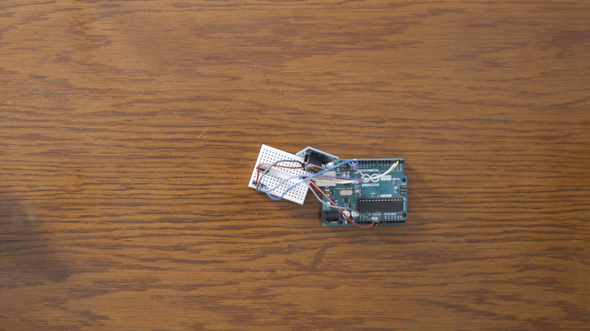
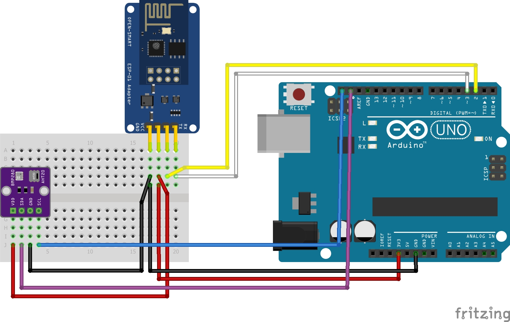
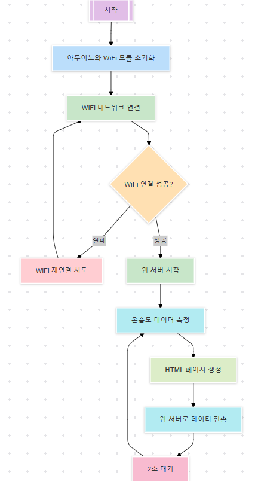

# 🎬 공학도서관 오리지널 컨텐츠
## 📊 아두이노로 만드는 나만의 기상청 

## 📝 프로젝트 소개
이 프로젝트는 ESP01 WiFi 모듈과 AHT20 센서를 아두이노와 연결하여 실시간으로 온도와 습도를 측정하고, 웹 브라우저에서 확인할 수 있는 IoT 장치를 만드는 과정을 설명합니다.

## 📚 사전학습
이 프로젝트를 시작하기 전에 아래 내용을 먼저 공부하고 오시면 좋아요.

- 아두이노 기초
  - 아두이노 IDE 설치하기
  - SoftwareSerial 라이브러리 사용법
  - I2C 통신 이해하기

- 통신 이해하기
  - WiFi 통신 기초
  - AT 명령어 이해하기
  - HTML 기본 구조 알아보기

- 센서 활용하기
  - I2C 센서 연결 방법
  - ESP01 모듈 사용법
  - 웹 서버 구축 방법

## 🎯 성취 목표
- ESP01 WiFi 모듈을 아두이노와 연결할 수 있다.
- AT 명령어로 ESP01을 제어할 수 있다.
- AHT20 센서에서 온습도 데이터를 읽을 수 있다.
- 간단한 웹 서버를 구축할 수 있다.
- 실시간으로 센서 데이터를 웹에서 확인할 수 있다.

## 🛠 준비물
- 아두이노 우노 보드
- ESP01 WiFi 모듈
- AHT20 온습도 센서
- M-M 점퍼선 (4개)
- F-M 점퍼선 (4개)
- USB 케이블 Type A/B
- 브레드보드

## 📋 회로 연결 방법

### ESP01 연결
| Arduino UNO | ESP01 |
|------------|-------|
| D2 (RX)    | TX    |
| D3 (TX)    | RX    |
| 3.3V       | VCC   |
| 3.3V       | CH_PD |
| GND        | GND   |

### AHT20 연결
| Arduino UNO | AHT20 |
|------------|-------|
| A4 (SDA)   | SDA   |
| A5 (SCL)   | SCL   |
| 3.3V       | VCC   |
| GND        | GND   |

> **주의**: ESP01과 AHT20은 모두 3.3V로 동작합니다!

## 💾 실습 코드
| 파일명 | 설명 |
|--------|------|
| [baudrate_change.ino](./src/bauderate_change/bauderate_change.ino) | IoT 온습도계 메인 코드 |
| [web_sensor_v2.ino](./src/web_sensor_v2/web_sensor_v2.ino) | IoT 온습도계 메인 코드 |

## 💻 주요 함수 설명
1. `void setupWiFi()`
   - WiFi 초기화 및 연결
   - 웹 서버 설정

2. `void getIP()`
   - IP 주소 확인
   - 웹 서버 접속 정보 출력

3. `void handleWebRequest()`
   - 웹 요청 처리
   - 센서 데이터 읽기 및 HTML 응답 생성

## ➡️ 순서도

## 🚀 시작하기
1. 라이브러리 설치하기
   - 'Adafruit AHTX0' 라이브러리 설치

2. 회로 연결하기
   - ESP01 모듈 연결
   - AHT20 센서 연결
   - 전원 연결 확인

3. 코드 업로드하기
   - WiFi 정보 수정
   - 코드 업로드
   - 시리얼 모니터 설정 (9600 baud, Both NL & CR)

4. 동작 확인하기
   - IP 주소 확인
   - 웹 브라우저에서 접속
   - 센서 데이터 확인

## 🔍 문제해결
- WiFi 연결이 안 돼요
  - WiFi 이름과 비밀번호 확인
  - ESP01의 전원(3.3V) 확인
  - CH_PD 핀이 3.3V에 연결되어 있는지 확인

- 센서 값이 이상해요
  - I2C 연결 확인
  - 센서 전원 확인
  - 라이브러리 설치 확인

- 웹 페이지가 안 열려요
  - IP 주소 다시 확인
  - 같은 WiFi 네트워크 접속 확인
  - ESP01 재시작 시도

## 🌟 이렇게 업그레이드 해볼 수 있어요
- 데이터 로깅 추가하기
  SD 카드 모듈을 추가하면 데이터를 저장할 수 있어요.

- 경보 기능 추가하기
  특정 온습도에서 알림을 보내도록 만들 수 있어요.

- 모바일 앱 연동하기
  앱 인벤터로 전용 앱을 만들어볼 수 있어요.

## 📚 참고 자료
- [ESP01 AT 명령어 가이드](https://www.espressif.com/sites/default/files/documentation/4a-esp8266_at_instruction_set_en.pdf)
- [AHT20 데이터시트](https://cdn-shop.adafruit.com/product-files/4566/4566_AHT20.pdf)
- [Adafruit AHTX0 라이브러리](https://github.com/adafruit/Adafruit_AHTX0)
